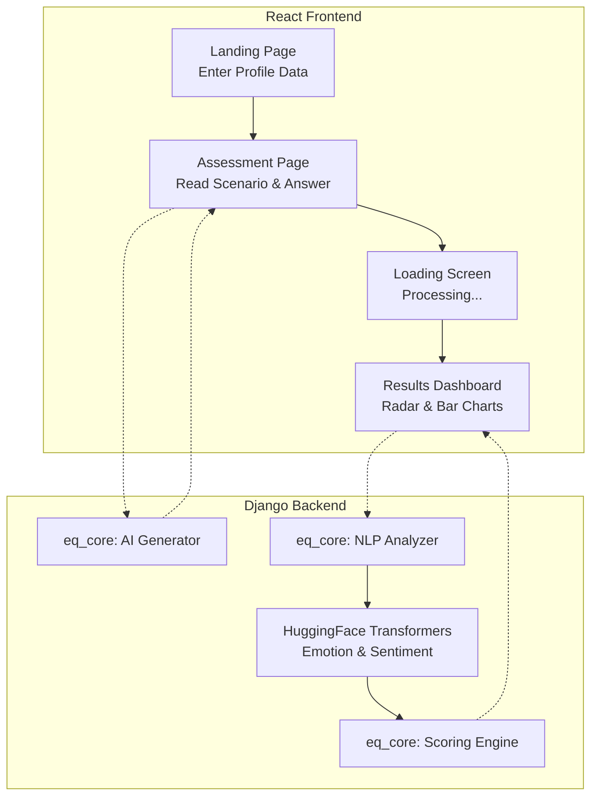
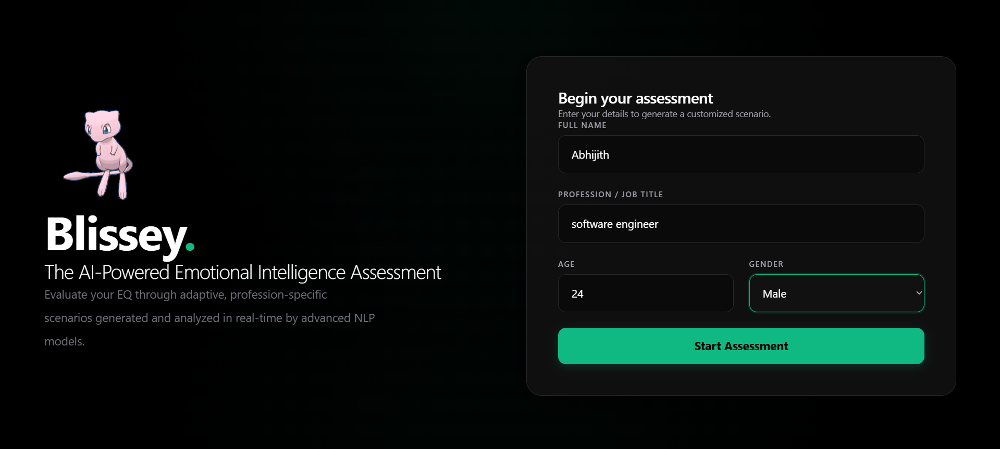
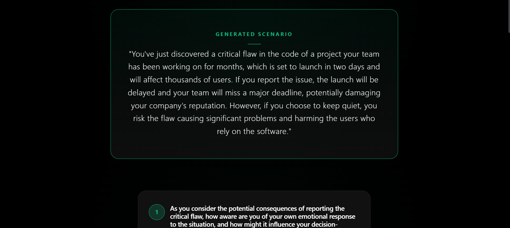
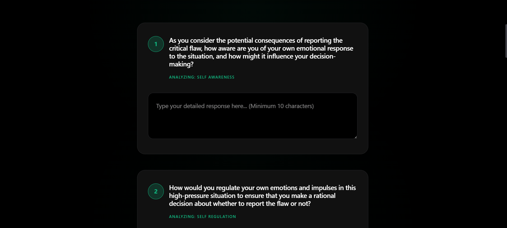
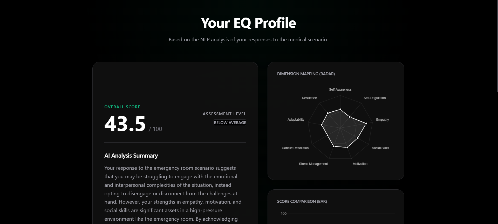
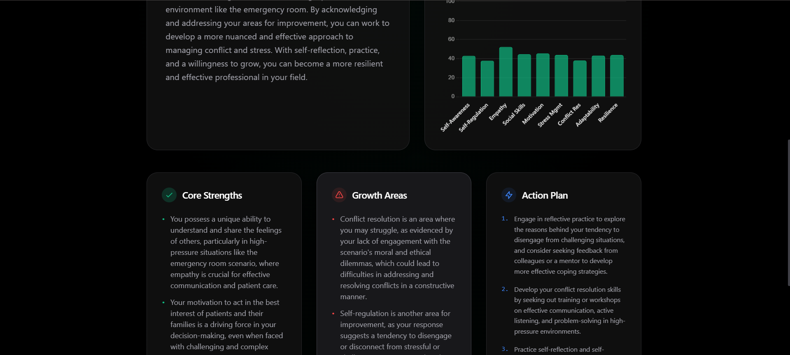

<<<<<<< HEAD
# 🧠 AI-Powered Emotional Intelligence Assessment

A modern, dynamic web application that evaluates a user's Emotional Intelligence (EQ) through personalized, profession-specific scenarios and advanced Natural Language Processing (NLP).

## 📊 Application Flow



---

## 🌟 Features & Screenshots

### 1. Personalized Setup
The assessment begins by gathering basic demographics to tailor the experience to your career stage and field.


### 2. Dynamic Scenario Generation
Based on your profile, the AI generates a realistic, emotionally challenging scenario along with 4-7 targeted questions.


### 3. Real-Time NLP Processing
While you wait, the backend utilizes HuggingFace Transformer models to analyze your raw text for emotional intensity, sentiment, and vocabulary richness.


### 4. Comprehensive Results Dashboard
Your responses are scored across **5 Core EQ Dimensions** (Self-Awareness, Self-Regulation, Empathy, Social Skills, and Motivation). The results are visualized using interactive Radar and Bar charts.


---

## 📋 System Requirements

To run this application locally, you will need:
- **Node.js** (v18.0 or higher) - Includes `npm` for the frontend.
- **Python** (v3.10 or higher) - For the Django backend.
- **Git** (optional, for cloning)

---

## 🚀 How to Run Locally

You need to run both the Backend and Frontend servers simultaneously in two separate terminal windows.

### 1. Start the Backend (Django)

Open your first terminal window, navigate to the `backend` folder, install dependencies, and start the server:

```powershell
# Navigate to the backend directory
cd backend

# Install required Python packages
pip install -r requirements.txt

# Run database migrations to setup the local SQLite database
python manage.py makemigrations
python manage.py migrate

# Start the Django development server
python manage.py runserver
```

*(Optional)* To use live AI generation instead of local fallbacks, create a `.env` file in the `backend` directory:
```env
GROQ_API_KEY=your_api_key_here
LLM_API_BASE=https://api.groq.com/openai/v1
LLM_MODEL=llama-3.3-70b-versatile
```

### 2. Start the Frontend (Vite/React)

Open a **new** terminal window, navigate to the `frontend` folder, install the node modules, and start Vite:

```powershell
# Navigate to the frontend directory
cd frontend

# Install Node dependencies
npm install

# Start the Vite development server
npm run dev
```

Once both servers are running, open your browser and navigate to `http://localhost:5173` to start the application!
=======
<div align="center">
  
  
  # Blissey: AI-Powered Emotional Intelligence Assessment
  
  **Live Demo:** [https://blissey-eq.netlify.app](https://blissey-eq.netlify.app)
</div>

---

Blissey is a modern, dynamic web application that evaluates a user's Emotional Intelligence (EQ) through highly personalized, profession-specific scenarios and advanced Natural Language Processing (NLP).

## 🌟 Key Features & Workflow

1. **Personalization**: You enter your basic information (Name, Age, Profession).
2. **Dynamic AI Generation (Groq)**: The backend uses the lightning-fast **Groq API** (`llama-3.3-70b-versatile`) to generate a realistic, high-stress scenario specifically tailored to your exact age and profession.
3. **Adaptive Assessment**: The Groq LLM dynamically generates 9 questions based on your specific scenario, targeting 9 distinct EQ dimensions (e.g., Empathy, Resilience, Self-Regulation).
4. **NLP Analysis (Hugging Face)**: Your written answers are sent to the backend where two pre-trained HuggingFace Transformer models analyze the raw text:
   - **Emotion Model (`j-hartmann/emotion-english-distilroberta-base`)**: Detects core emotions (Joy, Anger, Fear, Sadness, etc.).
   - **Sentiment Model (`cardiffnlp/twitter-roberta-base-sentiment-latest`)**: Evaluates if the tone is positive, negative, or neutral.
5. **Scoring Engine**: The system calculates a "Semantic Richness" score based on the length, depth, and vocabulary of your answer. This richness score acts as a multiplier against the NLP emotion scores to generate a final score out of 100 for each dimension.
6. **AI Psychological Report**: The system compiles your scores and answers, sending them back to the Groq LLM to generate a personalized, in-depth psychological feedback report highlighting your strengths and growth areas.
7. **Results & Visualization**: The app displays your overall EQ score and visualizes your dimensional profile using interactive Radar and Bar charts.
8. **PDF Export**: You can download a clean, professionally formatted PDF of your results generated via `reportlab` (Platypus Engine).

---

## 🧠 NLP Architecture & Memory Management

Running PyTorch and multiple Transformer models locally requires roughly **1.2 GB to 1.5 GB of RAM**. 

Because free hosting platforms like Render and Railway limit containers to **~512MB of RAM**, running these models natively in the backend causes immediate Out-of-Memory (OOM) crashes.

**How we run it right now:**
To bypass this limitation on the free tier, we are using the **Hugging Face Serverless Inference API**. Instead of downloading the 1GB model weights into our backend, we send the text to Hugging Face's API. This reduces our backend memory footprint to just ~100MB, completely eliminating crashes while making inference extremely fast.

**Running on a Premium Server:**
If you upgrade to a premium Render or Railway tier (with 2GB+ of RAM), you can bypass the API and run the models directly on your own server. You would simply change the pipeline setup to download the `.safetensors` model weights and execute inference locally via PyTorch inside the Django backend.

---

## 🧮 The Scoring Engine Algorithm

The EQ scoring system (`eq_scoring.py`) calculates the final 0-100 scores for each dimension using a precise 4-step algorithm:

### 1. Initialization
- **`Raw_Score`**: Starts at `50.0` for all 9 dimensions (neutral baseline).
- **`Weight`**: Starts at `1.0` for all 9 dimensions. If a question specifically targets a dimension, that dimension's weight increases by `+1.5`.

### 2. Hugging Face NLP Multipliers
The engine applies Confidence and Emotional Intensity scores (0.0 to 1.0) from the Hugging Face AI to the `Raw_Score`:

**Sentiment Math:**
* If Sentiment == `POSITIVE`: `Raw_Score += (10.0 × Sentiment_Score)`
* If Sentiment == `NEGATIVE` or `NEUTRAL`:
  * *For Regulation/Conflict/Stress:* `Raw_Score -= (10.0 × Emotional_Intensity)`
  * *For Awareness/Empathy:* `Raw_Score += (5.0 × Emotional_Intensity)`

**Emotion Math:**
* If `JOY` or `SURPRISE` ➔ *Motivation/Adaptability:* `Raw_Score += 10.0`
* If `ANGER` ➔ *Regulation/Conflict:* `Raw_Score -= (15.0 × Emotional_Intensity)`
* If `FEAR` ➔ *Stress/Resilience:* `Raw_Score -= (10.0 × Emotional_Intensity)`
* If `SADNESS`:
  * *Empathy:* `Raw_Score += 5.0`
  * *Resilience:* `Raw_Score -= (5.0 × Emotional_Intensity)`

### 3. Semantic Keyword Analysis
The system scans the combined response text for specific psychological keyword matches:
* For **every** positive phrase match (e.g., *"compromise"*): `Raw_Score += 8.0`
* For **every** negative phrase match (e.g., *"give up"*): `Raw_Score -= 12.0`

### 4. Normalization Formula
To prevent score inflation from highly-tested dimensions, the score is normalized, randomized slightly for organic variance, and clamped:
1. `Normalized_Score = Raw_Score / (Weight / 2.0)`
2. `Final_Score = Normalized_Score + Random(-2.0, 2.0)`
3. `Clamped_Score = max(0.0, min(100.0, round(Final_Score, 1)))`

---

## 📸 Screenshots

| Landing Page | Scenario Loading |
| :---: | :---: |
|  |  |

| Adaptive Questions | AI Analysis & Feedback |
| :---: | :---: |
|  |  |

| Radar & Bar Charts |
| :---: |
|  |
>>>>>>> adb8920347ad8e4a556b8494681a66789dd80096

---

## 🏗️ Architecture & File Structure

### Backend (Django REST Framework)
Located in `backend/`, the backend handles the heavy lifting of NLP analysis, LLM inference, and API endpoints.

<<<<<<< HEAD
**Core Logic (`backend/eq_core/`):**
- `definitions.py`: Defines the 5 core EQ dimensions, score indicators, and the HuggingFace model IDs.
- `nlp_analyzer.py`: Initializes and runs the HuggingFace text-classification pipelines to extract raw emotion and sentiment scores.
- `scoring_engine.py`: Combines NLP scores with keyword indicators to produce the final 0-100 scores.
- `ai_generator.py`: Calls an OpenAI-compatible endpoint to dynamically create personalized assessments.
- `questions.py`: Manages question templates mapped to the 5 EQ dimensions.
- `scenarios.py`: Provides rich fallback scenarios if the LLM is unavailable.
- `response_validator.py`: Ensures user text is high quality before NLP processing.

**API & Data (`backend/assessment/`):**
- `models.py`: Defines the database schemas (`UserAssessment`, `Scenario`, `Response`, `Result`).
- `views.py`: Exposes the REST API endpoints (`/start`, `/questions`, `/submit`, `/results`).

### Frontend (React + Vite + TailwindCSS)
Located in `frontend/`, providing a modern assessment UI with smooth Framer Motion animations.

- **React Router** for seamless page navigation.
- **Chart.js** for rendering the interactive data visualizations on the Results page.
- **TailwindCSS** for responsive, utility-first styling.
=======
**Core Files (`backend/eq_engine/`):**
- `constants.py`: Defines the 9 EQ dimensions, model identifiers, and scoring indicators.
- `emotion_analyzer.py`: Connects to the Hugging Face Inference API to extract raw emotion and sentiment scores in parallel.
- `eq_scoring.py`: Combines the NLP scores with a "Semantic Richness" calculator to produce the final 0-100 scores.
- `scenario_generator.py`: Uses the Groq API to dynamically generate a custom scenario.
- `question_generator.py`: Uses the Groq API to generate 9 scenario-specific questions.
- `feedback_generator.py`: Uses the Groq API to write a personalized psychological evaluation.

**API & Data (`backend/assessment/`):**
- `models.py`: Defines the SQLite database schemas.
- `views.py`: Exposes the REST API endpoints and handles the ReportLab PDF generation.

### Frontend (React + Vite + TailwindCSS)
Located in `frontend/`, the frontend provides a sleek, dark-themed, premium glassmorphism UI with smooth Framer Motion animations.

**Core Pages (`frontend/src/pages/`):**
- `LandingPage.jsx`: The entrance. Collects user demographics.
- `AssessmentPage.jsx`: Displays the dynamic scenario and cycles through the 9 questions.
- `LoadingPage.jsx`: A stylized waiting screen featuring a spinning Mew animation that actually handles the backend API processing in real-time.
- `ResultsPage.jsx`: The final dashboard displaying the Overall Score, Radar Chart, Bar Chart, and textual feedback.

---

## 🚀 Tech Stack

**Frontend:**
- React (Vite)
- TailwindCSS (Styling & Layout)
- Framer Motion (Animations)
- Chart.js (Data Visualization)

**Backend:**
- Python / Django REST Framework
- Groq API (`llama-3.3-70b-versatile`)
- Hugging Face Inference API (NLP Analysis)
- `reportlab` (PDF Generation)
- `gunicorn` & `whitenoise` (Production Deployment)

## ⚙️ Running Locally

1. **Backend:**
   ```bash
   cd backend
   pip install -r requirements.txt
   ```
   *Create a `.env` file in the root directory and add your `GROQ` and `HF_TOKEN` API keys.*
   ```bash
   python manage.py makemigrations
   python manage.py migrate
   python manage.py runserver
   ```

2. **Frontend:**
   ```bash
   cd frontend
   npm install
   npm run dev
   ```
>>>>>>> adb8920347ad8e4a556b8494681a66789dd80096
