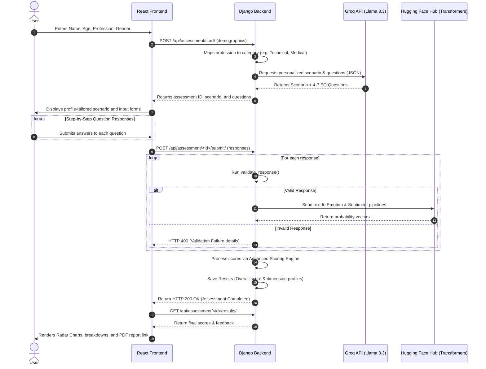

# EQ Assessment System

An intelligent, adaptive platform that measures Emotional Intelligence (EQ) through personalized, scenario-based assessments.

---

## Table of Contents
1. [Overview](#overview)
2. [Workflow and System Interaction](#workflow-and-system-interaction)
3. [Architecture & System Design](#architecture--system-design)
    - [Frontend Architecture](#frontend-architecture)
    - [Backend Architecture](#backend-architecture)
    - [Database Schema](#database-schema)
4. [Core AI & NLP Pipeline](#core-ai--nlp-pipeline)
    - [1. Generative AI Layer (Groq API)](#1-generative-ai-layer-groq-api)
    - [2. NLP Analysis Layer (Hugging Face API)](#2-nlp-analysis-layer-hugging-face-api)
    - [3. Local Dynamic Fallback Architecture](#3-local-dynamic-fallback-architecture)
5. [Advanced Scoring Engine & Heuristics](#advanced-scoring-engine--heuristics)
    - [The Scoring Formula](#the-scoring-formula)
    - [NLP Metric Mapping](#nlp-metric-mapping)
    - [Behavioral Keyword Indicators](#behavioral-keyword-indicators)
    - [Score Interpretation](#score-interpretation)
6. [Response Validation System](#response-validation-system)
7. [Screenshots & UI Walkthrough](#screenshots--ui-walkthrough)
8. [Installation and Configuration](#installation-and-configuration)
    - [Backend Setup](#backend-setup)
    - [Frontend Setup](#frontend-setup)

---

## Overview

The **EQ Assessment System** evaluates the five core dimensions of Emotional Intelligence—Self-Awareness, Self-Regulation, Empathy, Social Skills, and Motivation. Unlike traditional psychometric questionnaires that rely on static, multiple-choice options (which are prone to bias and social desirability answering), this platform uses a dynamic, open-ended format. 

By leveraging Large Language Models (LLMs) and natural language processing (NLP) models, the system dynamically crafts a situational scenario specific to the user's demographic profile (age and profession) and psychometrically evaluates their free-text behavioral responses.

---

## Workflow and System Interaction



---

## Architecture & System Design

The system implements a decoupled, modern web architecture:

### Frontend Architecture
- **Framework**: React 19 + Vite (built using ECMAScript Modules).
- **Styling**: TailwindCSS v4 for modern, utility-first design.
- **Routing**: `react-router-dom` v7 managing client-side views.
- **State Management**: React state hooks (`useState`, `useEffect`) and URL parameters to transition through landing, questionnaire, loading, and result phases.
- **Visualization**: `chart.js` with `react-chartjs-2` wrapper to render high-fidelity, interactive radar charts mapping the 5 dimensions.
- **Micro-Animations**: `framer-motion` for fluid, premium transitional sequences (e.g. cards moving in/out during step navigation).

### Backend Architecture
- **Framework**: Django 6.0 + Django REST Framework 3.17.
- **CORS Configuration**: `django-cors-headers` allowing seamless secure local and cross-domain requests.
- **Asynchronous Execution**: ThreadPoolExecutor pipelines in Python concurrency libraries to fire emotion and sentiment analysis requests in parallel to HuggingFace, cutting API latency in half.
- **Utility Integrations**: `python-dotenv` managing key-value credentials and API endpoint addresses securely outside of version control.
- **Reporting Engine**: `reportlab` creating high-quality PDF downloads of user performance metrics on-the-fly.

### Database Schema

The SQLite schema represents five entities designed to enforce data integrity and persist assessment states:

```
+---------------------+         +-----------------+         +------------------+
|   UserAssessment    | 1     1 |    Scenario     | 1     * |     Question     |
|---------------------|---------|-----------------|---------|------------------|
| id (UUID, PK)       |         | id (UUID, PK)   |         | id (UUID, PK)    |
| name (VARCHAR)      |         | assessment_id(FK|         | scenario_id (FK) |
| age (INT)           |         | scenario_text   |         | question_text    |
| gender (CHOICE)     |         | scenario_type   |         | eq_dimension     |
| profession (VARCHAR)|         | difficulty      |         | order (INT)      |
| overall_eq (FLOAT)  |         +-----------------+         +------------------+
| eq_level (CHOICE)   |                                               | 1
| is_completed (BOOL) |                                               |
| completed_at (DATE) |                                               | 1
|                     |         +-----------------+         +------------------+
|                     | 1     1 |     Result      |         |     Response     |
|                     |---------|-----------------|         |------------------|
|                     |         | id (UUID, PK)   |         | id (UUID, PK)    |
|                     |         | assessment_id(FK|         | question_id (FK) |
|                     |         | self_awareness  |         | assessment_id(FK)|
|                     |         | self_regulation |         | user_answer(TEXT)|
|                     |         | empathy         |         | emotion_detected |
|                     |         | social_skills   |         | emotion_scores   |
|                     |         | motivation      |         | sentiment_label  |
|                     |         | overall_score   |         | sentiment_score  |
|                     |         | feedback_text   |         | intensity        |
+---------------------+         +-----------------+         +------------------+
```

---

## Core AI & NLP Pipeline

The application features a hybrid AI architecture, utilizing both Generative AI for personalization and Deep Learning Transformers for semantic validation and analysis.

### 1. Generative AI Layer (Groq API)
- **Model**: `llama-3.3-70b-versatile` (instruct-tuned model).
- **Execution**: Triggered in `backend/eq_core/ai_generator.py` through standard `urllib` calls hitting the Groq API gateway.
- **Structured Output**: Enforced using `"response_format": {"type": "json_object"}`. The prompt dictates a strict schema containing exactly one scenario text (120-220 words) and 4-7 dimensions-aligned questions.
- **Profession Mapping**: Free-form input from the user is fuzzy-matched into 6 core groups to direct the LLM:
  * **Technical**: Software engineering, DevOps, Data Science, etc.
  * **Medical**: Doctors, Nurses, Therapists, etc.
  * **Education**: Teachers, Professors, Researchers.
  * **Management**: Managers, Project Leads, HR, Executive roles.
  * **Creative**: Designers, Writers, Artists, Content Creators.
  * **General**: Default bucket for students, freelancers, or unmapped roles.

### 2. NLP Analysis Layer (Hugging Face API)
Instead of requiring a resource-heavy PyTorch installation on the server, the application communicates with HuggingFace Hub's serverless inference endpoints to process the answers:
- **Emotion Pipeline**: `j-hartmann/emotion-english-distilroberta-base`
  * Categorizes statements across 7 target labels: `anger`, `disgust`, `fear`, `joy`, `neutral`, `sadness`, and `surprise`.
- **Sentiment Pipeline**: `distilbert-base-uncased-finetuned-sst-2-english`
  * Gauges the tone of the response (`POSITIVE` or `NEGATIVE`) along with confidence parameters.

### 3. Local Dynamic Fallback Architecture
If no API keys are present (or if the APIs throw rate-limits/errors), the backend falls back to offline mode:
- **Dynamic Scenarios**: Scenarios are dynamically stitched from pre-configured archetype templates located in `backend/eq_core/scenarios.py` (e.g., critical production rollback for technicians, hostile bedside encounters for medics) and tailored with age and profession-specific labels.
- **Adaptive Questions**: Question templates mapped to missing dimensions are automatically injected. This ensures the app is fully functional off-grid.

---

## Advanced Scoring Engine & Heuristics

The calculation engine (`backend/eq_core/scoring_engine.py`) employs a multi-tiered scoring matrix combining machine learning signals with rules-based heuristic constraints.

### The Scoring Formula
1. **Base Score Initialization**: Every EQ dimension starts with a baseline value of `50.0`.
2. **Dimension Weighting**: When a question specifically targets a dimension, its weight is increased:
   $$\text{Weight}_{\text{dim}} \mathrel{+}= 1.5$$
3. **Sentiment & Emotion Adjustments**: NLP probabilities modify the raw scores.
4. **Behavioral Indicator Adjustments**: System scans the globally concatenated response text for behavioral indicators.
5. **Normalization & Clamping**:
   $$\text{Score}_{\text{norm}} = \frac{\text{Score}_{\text{raw}}}{\max(1.0, \text{Weight}_{\text{dim}} / 2.0)} + \epsilon$$
   *(where $\epsilon$ is a small organic variance parameter between $-2.0$ and $+2.0$ to make scoring feel organic, clamped between $0.0$ and $100.0$)*.

### NLP Metric Mapping

The engine rewards and penalizes dimensions based on the psychological traits expressed:

| Dimension | NLP Signal | Score Change | Rationale |
| :--- | :--- | :--- | :--- |
| **All Dimensions** | Positive Sentiment | $+10.0 \times \text{Confidence}$ | Positive tone indicates constructive conflict resolution. |
| **Self-Regulation / Social Skills** | Negative Sentiment | $-10.0 \times \text{Intensity}$ | Inability to maintain composure during stressful events. |
| **Self-Awareness / Empathy** | Negative Sentiment | $+5.0 \times \text{Intensity}$ | Acknowledging stress/sadness demonstrates high emotional awareness. |
| **Motivation / Social Skills** | Joy / Surprise | $+10.0$ | Reflects optimism and enthusiasm. |
| **Self-Regulation / Social Skills** | Anger (Emotion) | $-15.0 \times \text{Intensity}$ | Severe lack of self-regulation or professional composure. |
| **Self-Regulation / Motivation** | Fear (Emotion) | $-10.0 \times \text{Intensity}$ | Fear-induced freezing reduces situational motivation/regulation. |
| **Empathy** | Sadness (Emotion) | $+5.0$ | Indicates emotional attunement and empathy for others' distress. |
| **Motivation** | Sadness (Emotion) | $-5.0 \times \text{Intensity}$ | High sadness correlates with a lack of drive or defeatist attitude. |

### Behavioral Keyword Indicators

The globally concatenated answers are searched via regex patterns to find critical indicators:

- **Positive Indicators (+8.0 per match)**:
  * *Self-Awareness*: `"i feel"`, `"i realize"`, `"i'm aware"`, `"reflecting on"`, `"my own bias"`.
  * *Self-Regulation*: `"stay calm"`, `"take a breath"`, `"think before"`, `"respond rather than react"`.
  * *Empathy*: `"they might feel"`, `"in their shoes"`, `"validate their feelings"`, `"their point of view"`.
  * *Social Skills*: `"collaborate"`, `"listen actively"`, `"find common ground"`, `"de-escalate"`.
  * *Motivation*: `"learn from this"`, `"bounce back"`, `"grow"`, `"stay focused on the goal"`.
- **Negative Indicators (-12.0 per match)**:
  * *Self-Awareness*: `"don't know why"`, `"whatever"`, `"not my problem"`, `"that's just how i am"`.
  * *Self-Regulation*: `"explode"`, `"yell"`, `"lash out"`, `"lose my temper"`, `"storm out"`.
  * *Empathy*: `"their fault"`, `"blame them"`, `"they're overreacting"`, `"get over it"`.
  * *Social Skills*: `"avoid"`, `"ignore them"`, `"isolate"`, `"refuse to engage"`, `"ghost"`.
  * *Motivation*: `"give up"`, `"pointless"`, `"why bother"`, `"never going to work"`.

### Score Interpretation

*   **Low EQ (0 - 40)**: Indicates significant room for growth. Struggles to regulate impulses under pressure or read others' emotions.
*   **Average EQ (41 - 70)**: Functional EQ with clear strengths. Can handle emotions but may show inconsistency under high-stress conditions.
*   **High EQ (71 - 100)**: Strong emotional awareness, composed under pressure, communicates constructively, and maintains optimism.

---

## Response Validation System

To prevent spam, low-effort responses, or gibberish from polluting the NLP pipelines, a validation check is performed before sending requests to Hugging Face:

1. **Empty Check**: Rejects empty submissions.
2. **Length Constraints**: Minimum `10` characters, maximum `5000` characters.
3. **Word Constraints**: Minimum `3` words required to explain thought processes.
4. **Spam Keyword Matching**: Checks for placeholders (`idk`, `na`, `n/a`, `lol`, `test`, `qwerty`, `asdf`).
5. **Character Repetition Check**: Rejects inputs with $< 3$ unique characters (e.g. `aaaaaaa...`).
6. **Numeric Check**: Rejects answers composed solely of numbers.

---

## Screenshots & UI Walkthrough

### 1. Profile Setup
Users input their demographic profile. The system fuzzy-matches the profession and targets scenarios for maximum context alignment:


### 2. Scenario and Questionnaire Page
Step-by-step navigation displaying the personalized situational scenario along with progressive, interactive forms:


### 3. Results Dashboard
An overview of results featuring high-level statistics and a custom Chart.js radar graph plotting dimension metrics:


### 4. Dimension Performance Breakdown
Detailed score cards outlining performance along with actionable development insights:


---

## Installation and Configuration

### Backend Setup

1. Navigate to the backend directory:
   ```bash
   cd backend
   ```
2. Create and activate a python virtual environment:
   ```bash
   python -m venv venv
   # On Windows:
   .\venv\Scripts\activate
   # On Unix:
   source venv/bin/activate
   ```
3. Install dependencies:
   ```bash
   pip install -r requirements.txt
   ```
4. Create a `.env` file in the `backend` directory containing the following environment keys:
   ```env
   # API Keys
   GROQ_API_KEY=your_groq_api_key_here
   HF_TOKEN=your_hugging_face_user_access_token_here

   # Settings
   DEBUG=True
   SECRET_KEY=django-insecure-development-key
   ```
5. Apply database migrations:
   ```bash
   python manage.py migrate
   ```
6. Start the local server:
   ```bash
   python manage.py runserver
   ```
   *The backend will boot up at `http://127.0.0.1:8000/`*

### Frontend Setup

1. Navigate to the frontend directory:
   ```bash
   cd frontend
   ```
2. Install npm packages:
   ```bash
   npm install
   ```
3. Start the Vite development server:
   ```bash
   npm run dev
   ```
   *The client interface will boot up at `http://localhost:5173/`*
